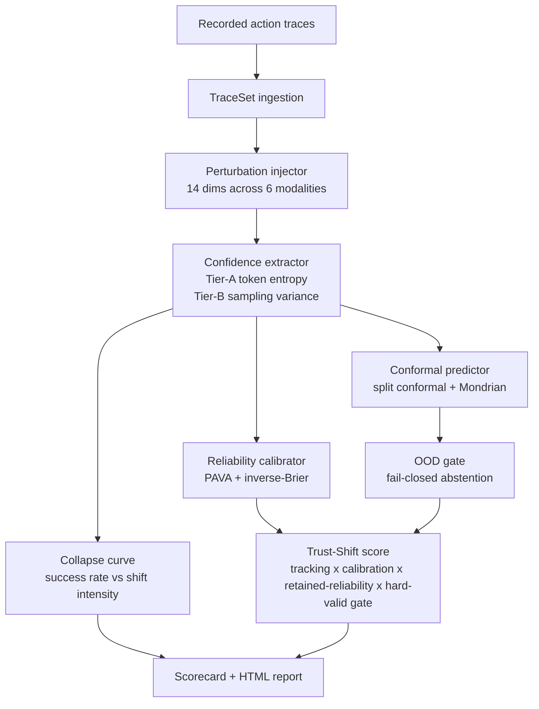

# vlatrust

**Calibration-under-shift trust harness for Vision-Language-Action (VLA) policies.**

A VLA policy can score ~97% on its in-distribution benchmark and then drop to
near-0% the moment the scene, lighting, instruction phrasing, or initial state
shifts — *while remaining just as confident*. `vlatrust` measures exactly that
failure mode: **does a policy's confidence degrade in step with its competence
as input distribution shift rises?**

It works over **recorded action traces** (no GPU, no simulator required for the
core), emitting:

- a **conformal abstention gate** with distribution-free finite-sample coverage,
- a **Reliability-Shift / collapse curve** (success rate vs. perturbation intensity, per modality),
- a single **Trust-Shift score** that is high only when the policy *flags its own* degradation.

## Architecture overview



## Status & honesty (read this first)

**v0.1.0a1 is a pre-alpha _framework_.** What is and isn't backed by data:

- ✅ **The metric's behaviour is validated** — a 163-test CPU suite, plus an
  env-stamped measurement (`bench_results/v0.1.0a1_falsification.json`).
- ⚠️ **The falsification numbers below are from deterministic _synthetic_ fixtures**
  (`MockPolicy`), **not** recorded real-robot traces. They show the *metric* is
  correct, not that any specific real policy behaves a certain way.
- ⏳ **Empirical real-trace validation is deferred to v0.1.1.** Reproducing
  high-success-then-collapse on a *recorded real trace* needs either live OpenVLA
  inference (GPU) or a permissively-licensed graded-perturbation benchmark
  (LIBERO-plus ships no license, so it is not a dependency — see NOTICE).

No real-policy claim is made or implied by the a1 numbers.

## The one claim (falsifiable)

> For VLA policies that expose token-level confidence (Tier-A, e.g. OpenVLA),
> a well-calibrated policy earns a **high** Trust-Shift score and a
> confidently-wrong policy earns a **low** one.

Falsification test (run in CI, on synthetic fixtures): a confidently-collapsing
policy **must** score below a gracefully-degrading one, and an abstention-enabled
variant **must** out-score its abstention-disabled twin. Measured
(`bench_results/`, synthetic, seed 0):

| quantity (synthetic fixtures) | α=0.1 | α=0.25 |
|---|---|---|
| gracefully-degrading Trust-Shift | **0.749** | **0.795** |
| confidently-collapsing Trust-Shift | **0.496** | **0.503** |
| abstention on vs. off | 0.749 / 0.749 (no-op¹) | 0.795 / 0.749 |
| every-trajectory-physically-invalid Trust-Shift | **0.000** (hard gate) | |

¹ At α=0.1 the gate correctly abstains on nothing here: the worst stratum's
miscoverage exceeds the 10% budget, so the conformal threshold admits all — the
honest, designed behaviour, not a bug. The gate engages at α=0.25.

Real-math anchors that need no policy (same record): the Tier-A token-entropy
extractor gives confidence ≈1.0 on a peaked action-token distribution and
≈1/256 on a uniform one; split-conformal marginal coverage is **0.9004** over 300
splits against a 0.90 nominal target.

## Why calibration, not just perturbation

Perturbation-robustness benchmarking for VLAs already exists (e.g. RobustVLA /
LIBERO-plus), and dataset-quality heuristics (e.g. LeRobot episode scorers) score
*data*, not *trust*. `vlatrust`'s layer is the **cross-model
calibration-under-shift** measurement on top: conformal coverage, a reliability
gap (reference-vs-target, calibrated-vs-actual), and a fail-closed
out-of-distribution action gate — as one harness over recorded traces.

## Tiers (what confidence means per policy family)

| Tier | Policy family | Confidence source | Trust-Shift claim |
|------|---------------|-------------------|-------------------|
| A | token/autoregressive (OpenVLA) | token entropy (native) | full claim |
| B | flow-matching (π0, SmolVLA, GR00T) | sampling variance (opt-in, GPU) | NON-claim (v0.1.1) |
| — | no exposable confidence | `ConfidenceSource.NONE` | abstention axis returns `N/A` (fail-closed) |

`vlatrust doctor` reports which backends are live vs. mock vs. unavailable on
your machine, so a mock run is never mistaken for a live one.

## Install

```bash
pip install vlatrust                 # core: recorded-trace path, numpy only
pip install "vlatrust[openvla]"      # Tier-A token-confidence backend (torch)
pip install "vlatrust[lerobot]"      # ingest LeRobot datasets (pyarrow)
```

(PyPI publication is part of v0.1.1; install from the GitHub release/source for a1.)

## Quickstart

```bash
vlatrust doctor                      # which backends are live vs. mock
vlatrust score   --mock --html report.html   # synthetic demo -> scorecard + HTML
vlatrust score   <trace.json>        # full scorecard (JSON + self-contained HTML)
vlatrust calibrate <trace.json>      # calibration report only
```

```text
$ vlatrust score --mock              # illustrative (deterministic synthetic input)
** Input is a deterministic MOCK TraceSet — illustrative, not an empirical measurement.
Trust-Shift: 0.749  (source=token_entropy, physically_valid=True)
  tracking=0.970
  inverse_brier=0.867
  retained_reliability=0.410
  hard_valid_factor=1.000
  abstention_gate=on
```

## How it works

### Trust-Shift score composition

The headline score is composed multiplicatively through four axes:

```
Trust-Shift = hard_valid_factor × blend(tracking, calibration, retained_reliability)
```

- **hard_valid_factor** (`h`): fraction of trajectories with physically valid
  actions (joint limits, velocity caps). A policy commanding invalid actions
  is pulled toward 0 regardless of confidence.
- **tracking** (`T`): `1 - mean_τ |confidence(τ) - success_rate(τ)|` across
  perturbation intensities. This is the core claim — confidence must fall in
  step with success as shift rises.
- **calibration** (`C`): inverse-Brier score of confidence vs. success.
- **retained_reliability** (`R`): success rate among trajectories the conformal
  abstention gate accepts. A useful gate raises `R` above the accept-all baseline.

If `ConfidenceSource.NONE` the score is `None` — never fabricated (fail-closed).

### Perturbation injector

14 post-hoc perturbation dimensions span 6 modalities:

| Modality | Example dims |
|----------|-------------|
| `language` | instruction rephrasing, negation |
| `init_state` | object pose jitter |
| `sensor_noise` | brightness shift, gaussian noise, salt-pepper |
| `dynamics` | latency shift, step dropout |
| `camera` | viewpoint shift |
| `actuation` | action delay, scale |

Perturbations are applied post-hoc to recorded traces; no simulator is needed
for the CPU-only core path.

### Conformal abstention gate

Split conformal prediction (+ Mondrian stratification by modality + weighted
variant) computes a finite-sample-valid nonconformity threshold at coverage level
`1-α`. Steps whose nonconformity exceeds the threshold are abstained; the OOD
gate is fail-closed (unknown → ABSTAIN).

## Scope

- **In (v0.1.0a1):** TraceSet core; 14 post-hoc perturbation dims (own injector);
  `ConfidenceSource` enum + OpenVLA Tier-A confidence extractor; spike-preserving
  sequence-level conformal (+ Mondrian, + weighted); reliability gap (Δ_succ,
  Δ_cov); fail-closed OOD action gate; collapse curve + fragility; PAVA /
  inverse-Brier / multiplicative gate / bootstrap CI; self-contained HTML
  scorecard; CPU-only tests.
- **Deferred (v0.1.1):** real-trace empirical validation; renderer-heavy 3
  perturbation dims (GPU); flow-matching sampling-variance adapter (Tier-B); live
  OpenVLA / π0 / GR00T inference; sim integration; PyPI.
- **Deferred (v0.2):** sim→real gap on real-robot traces; GR00T backend;
  evolutionary score-hardening.

## License

MIT. See [LICENSE](LICENSE). vlatrust bundles no
third-party model code or weights, and does **not** depend on LIBERO-plus
(which ships no license).
